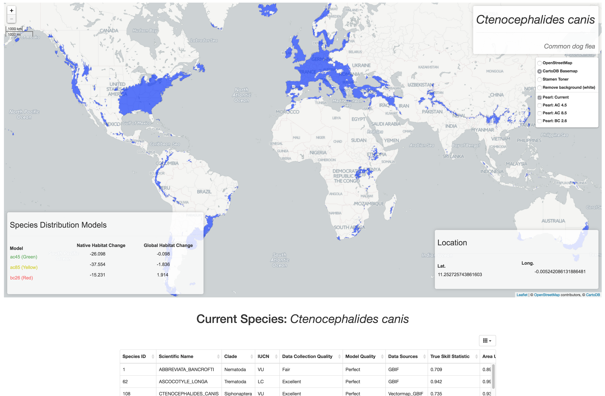
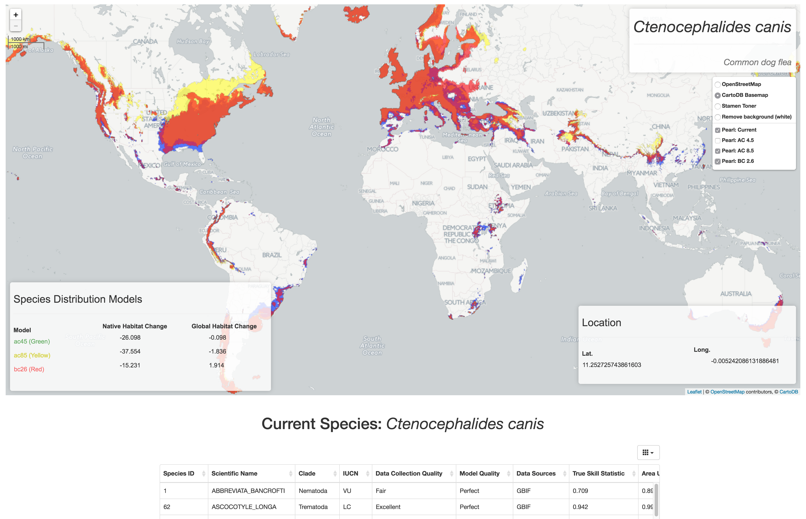

# PEARL2.0

Mapping global projections of current and future distributions of 450+ species of parasites.

**PEARL2.0** makes use of *EWAIM*, a mapping framework developed by [Oliver Muellerklein](http://thru-echoes.github.io/) and [Zhongqi Miao](https://github.com/ranranking) of the [Wayne Getz lab](https://nature.berkeley.edu/getzlab/) at UC Berkeley for interactive web mapping. *EWAIM* is also used for interactive web mapping of big data / high traffic data systems - see our project on [visualizing movement of migratory birds in Israel](https://github.com/Thru-Echoes/BirdShader).

## 1. EWAIM: an Extensible Web App for Interactive Mapping

#### 1.1 Overview

**EWAIM-webapp** is a web mapping app that uses *Leaflet x D3 (Javascript)* on the frontend and *Flask x PostGreSQL* on the backend. In addition, we include a directory titled **EWAIM** that contains a Python package for some simple data analysis and utility functionality - used in the backend. The **EWAIM** package has *continuous testing* through Travis-CL. Users of this app (for now) need to run the *setup.py* file to make the EWAIM module (*EWAIM is imported and used in the main Flask app.py file*). Our future development includes building further data processing and analysis functions as well as **Species Distribution Model** functions in the EWAIM package focused on spatial, movement, and time series data.

Species: *Abbreviata bancrofti*

Showing predicted changes in native and global habitat due to climate trends using three different distribution models (*green, yellow, and red*). Current distribution shown in **blue**.





#### 1.2 Research Application

EWAIM (the webapp as well as the package) will be extended for direct research applications with at least two large-scale research projects in the **Wayne Getz lab at UC Berkeley**. One will be for the *Israel Migratory Bird* project - a study that is collecting spatial data of bird movement (roughly 2 million points daily). The other direct application is for *PEARL: Parasite Extinction Assessment and Red-Listing* - a database of Species Distribution Models (predictions of presence / absence) of species of parasites currently and future projections based on climate change trends.

## 2. Setup

#### 2.1 CLI Setup of EWAIM Module

```
    $ python3 setup.py install
    # And test (used for Travis-CL)
    $ python3 setup.py test
```

#### 2.2 Data Preparation

- See `database_prep` folder for database setup.
- See `raster_data_prep` folder for raster data preparation.

For the sake of this project submission we provide pre-made CSVs and database (*database_prep/temperature.gz*) for the data instead. This is because installing packages / modules **GDAL** can likely cause system-based errors. Normally we will use proper database connections (as our utility functions show) for connections to the data for layers and analysis.

**NOTE:** follow instructions in **database_prep** and **raster_data_prep**    

**NOTE:** must install all database dependencies as described in *database_prep/README.md* for the non-example version of this app!
